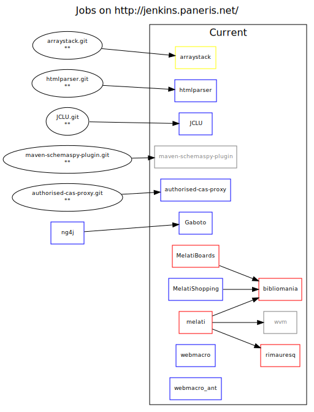

Jenkins-Graphviz
================

Requirements
------------

 * Python 2.7
 * [lxml](http://lxml.de/)
 * GraphVIS

Usage example
-------------

        python jenkins_graphviz.py -v 'Some View' http://jenkins.example.com/ \
          --username <username> --password <password>
          | dot -Tsvg > some_view.svg

